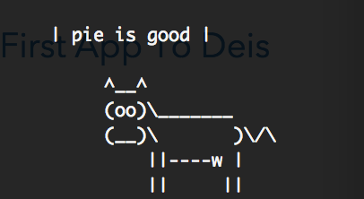
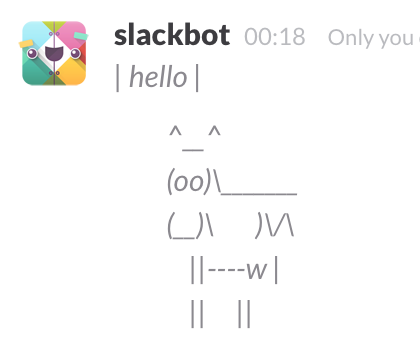

##cowsay

It's a poorly spaced flask wrapper for cowsay as a slack slash command. 


###Installation

You'll need the cowsay gem and, unless you really want a live flask server for cowsay, also install ngrok.

```
gem install cowsay
```

and grab [ngrok](https://dl.ngrok.com/ngrok_2.0.19_darwin_amd64.zip). Unzip and spin one up:

```
ngrok http 5050
```

Grab the `https` from the spin-up output to use as the Slack URL and be sure to run the flask app with the same port. It is less than ideal really - anytime you need to spin up ngrok, the slack url changes. ¯\_(ツ)_/¯

Set up the slack slash command, update the token in the app code, run flask and ngrok. 

Test it out with the localhost flask URL or the ngrok tunnel:

```
curl -d 'text=base:pie is good' http://localhost:5000
```



and, of course, in slack:

```
/cowsay base:hello
```



Including `base:` before your text always returns the cow; just sending text leaves you at the mercy of the gem. I obviously prefer the cow.

This is ridiculous. You're welcome.

